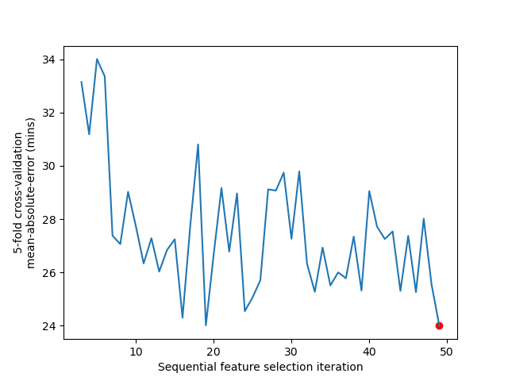
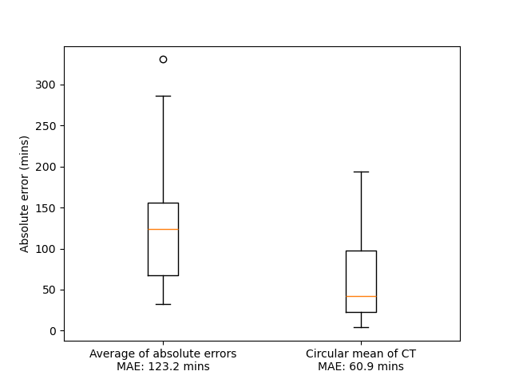

# ChronoGauge ensemble
Connor Reynolds1, Joshua Colmer1, Hannah Rees2, Ehsan Khajouei1, Rachel Rusholme-Pilcher1, Hiroshi Kudoh3, Antony Dodd4, Anthony Hall1,5

1Earlham Institute, Norwich Research Park
2Institue of Biological, Environmental & Rural Sciences (IBERS)
3Centre for Ecological Research, Kyoto University
4John Innes Centre, Norwich Research Park
5School of Biological Sciences, University of East Anglia

## Overview
ChronoGauge is a bagging-like ensemble model for circadian time (CT) estimation from transcriptome samples (e.g. RNA-seq, microarray).

ChronoGauge is trained using Arabidopsis RNA-seq data and has been applied across various contexts including:
* Testing hypotheses related to the circadian clock in RNA-seq data (e.g. between control samples and those exposed to experimental pertubations)
* Microarray samples
* Non-model species using gene orthologs

The ensemble of subpredictors can be generated by running a custom sequential feature selection (SFS) wrapper multiple times using different seed values. Each SFS run outputs a unique feature set that can be used to train a subpredictor. These subpredictors can be applied to test datasets that include these feature sets and their predictions aggregated to provide a CT estimate that is robust in spite of technical variation/batch effects.

## Sequential feature selection (SFS)
To build a set of predictive gene features, we provide the script `sfs_main_git.py` to execute a single SFS run, as well as a detailed example in the notebook `example_sfs_wrapper.ipynb`.

The custom SFS wrapper takes:
1. A training expression matrix (e.g. `data/expression_matrices/x_training.csv`)
2. Time-point labels for each sample (e.g. `data/targets/target_training.csv`)
3. Prior circadian information regarding each gene feture's phase (in 4-hour bins ranging 0-24) & Q-value determined using MetaCycle (meta2d method) (e.g. `data/sfs_input/sfs_gene_info.csv`). We provide the notebook `example_prior_information.ipynb` to demonstrate how prior information is obtained from the MetaCycle results. 

Pre-processing follows these steps:
1. Only gene features with a circadian rhyhtmicity meta2d Q < 0.05 are selected
2. A bootstrap is applied to randomly select a determined proportion of genes (default 50%).
3. The top _N_ gene features from each phase bin are selected (default _N_ = 25).
4. A gene is selected at random to initialize the feature set.

The SFS algorithm iteratively searches for genes which optimize the mean-absolute-error (MAE) within 5-fold cross-validation, whilst also mantaining a balance across gene phase bins. The algorithm outputs any feature set giving a MAE under 60 mins. We recommended running the script for a specified duration (e.g. 6 CPU hours), then selecting the feature set giving the minimum MAE. The notebook `example_sfs_results.ipynb` demontrates how the outputs can be analyzed to select the optimal feature set.

We note that the SFS is intended to generate multiple feature sets for building an ensemble of sub-predictors. While a single predictor can be generated, it is unlikely the model will be reliable across unseen data.

## Model training
To train a model with a specified feature set and list of hyperparameters, we provide the script `train_model.py`. By default, the script will train a model using 17 cannonical circadain clock genes as features.

Additionally, we provide the notebook `example_model_training.ipynb` as a more detailed walkthrough.

## Saved models
The ensemble of sub-models that were fit to the `data/expression_matrices/x_training.csv` RNA-seq expression matrix can be found within the following Hugging Face repositories:
* [ChronoGauge ensemble for _Arabidopsis_ RNA-seq data](https://huggingface.co/conjr94/ChronoGauge_RNAseq)
* [ChronoGauge ensemble for _Arabidopsis_ ATH1 microarray data](https://huggingface.co/conjr94/ChronoGauge_ATH1_microarray)
* [ChronoGauge ensemble for _Arabidopsis_ AraGene microarray data](https://huggingface.co/conjr94/ChronoGauge_AraGene_microarray)

The notebook `example_test_trained.ipynb` will demonstrate how to use saved sub-models to make predictions across test data.

The notebook `example_ensemble_aggregation.ipynb` will demonstrate how to aggregate the CT predictions across multiple sub-models using a circular mean. Based on cross-validation results, we expect that combining the CT predictions of multiple sub-models will give more reliable results compared with using any individual model.

While all models were trained using only RNA-seq data, ensembles generated for microarray experiments included only gene features that are present within each platforms gene set. Each ensemble includes 100 models using feature sets geenrated by SFS. 

## Dependencies
Scripts use the following:
* Python v3.9.5
* tensorflow==2.6
* scikit-learn==0.24.2

## Datasets
* Training Arabidopsis data (_N_ samples = 56) includes experiments from _Cortijo et al._[1], _Yang et al._[2] and _Romanowski et al._[3].

* A collection of RNA-seq test datasets (_N_ samples = 58) were selected for benchmarking ChronoGauge including _Rugnone et al._[4], _Miller et al._[5], _Takahashi et al._[6], _Ezer et al._[7], _Graf et al._[8] and _Dubois et al._[9].

* A collection of ATH1 micorarray test datasets (_N_ samples = 73) were also selected for benchmarking including _Edwards et al._[10], _Covington et al._[11], _Michael et al._[12] and _Espinoza et al._[13].

* An AraGene microarray test dataset (_N_ samples = 72) was also selected for benchmarking by _Endo et al._[14].

* Samples for testing hypotheses related to clock include those by _Rugnone et al._[4], _Ezer et al._[7], _Graf et al._[8], _Blair et al._[15] and _Dubin et al._[16].

## Refernces
1. Cortijo, S., Aydin, Z., Ahnert, S. & Locke, J. C. Widespread inter‐individual gene expression variability in Arabidopsis thaliana. Mol. Syst. Biol. 15, (2019).
2. Yang, Y., Li, Y., Sancar, A. & Oztas, O. The circadian clock shapes the Arabidopsis transcriptome by regulating alternative splicing and alternative polyadenylation. J. Biol. Chem. 295, 7608 (2020).
3. Romanowski, A., Schlaen, R. G., Perez-Santangelo, S., Mancini, E. & Yanovsky, M. J. Global transcriptome analysis reveals circadian control of splicing events in Arabidopsis thaliana. Plant J. 103, 889–902 (2020).
4. Rugnone, M. L., Soverna, A. F., Sanchez, S. E., Schlaen, R. G., Hernando, C. E., Seymour, D. K., Mancini, E., Chernomoretz, A., Weigel, D., Más, P. & Yanovsky, M. J. LNK genes integrate light and clock signaling networks at the core of the Arabidopsis oscillator. Proc. Natl. Acad. Sci. U. S. A. 110, 12120 (2013).
5. Miller, M., Song, Q., Shi, X., Juenger, T. E. & Chen, Z. J. Natural variation in timing of stress-responsive gene expression predicts heterosis in intraspecific hybrids of Arabidopsis. Nat. Commun. 6, 7453 (2015).
6. Takahashi, N., Hirata, Y., Aihara, K. & Mas, P. A Hierarchical Multi-oscillator Network Orchestrates the Arabidopsis Circadian System. Cell 163, 148–159 (2015).
7. Ezer, D., Jung, J.-H., Lan, H., Biswas, S., Gregoire, L., Box, M. S., Charoensawan, V., Cortijo, S., Lai, X., Stöckle, D., Zubieta, C., Jaeger, K. E. & Wigge, P. A. The Evening Complex coordinates environmental and endogenous signals in Arabidopsis. Nat. Plants 3, 17087 (2017).
8. Graf, A., Coman, D., Uhrig, R. G., Walsh, S., Flis, A., Stitt, M. & Gruissem, W. Parallel analysis of Arabidopsis circadian clock mutants reveals different scales of transcriptome and proteome regulation. Open Biol. 7, 160333 (2017).
9. Dubois, M., Claeys, H., Van den Broeck, L. & Inzé, D. Time of day determines Arabidopsis transcriptome and growth dynamics under mild drought. Plant Cell Environ. 40, 180–189 (2017).
10. Edwards, K. D., Anderson, P. E., Hall, A., Salathia, N. S., Locke, J. C. W., Lynn, J. R., Straume, M., Smith, J. Q. & Millar, A. J. FLOWERING LOCUS C Mediates Natural Variation in the High-Temperature Response of the Arabidopsis Circadian Clock. Plant Cell 18, 639–650 (2006).
11. Covington, M. F. & Harmer, S. L. The Circadian Clock Regulates Auxin Signaling and Responses in Arabidopsis. PLoS Biol. 5, e222 (2007).
12. Michael, T. P., Breton, G., Hazen, S. P., Priest, H., Mockler, T. C., Kay, S. A. & Chory, J. A Morning-Specific Phytohormone Gene Expression Program underlying Rhythmic Plant Growth. PLOS Biol. 6, e225 (2008).
13. Espinoza, C., Degenkolbe, T., Caldana, C., Zuther, E., Leisse, A., Willmitzer, L., Hincha, D. K. & Hannah, M. A. Interaction with Diurnal and Circadian Regulation Results in Dynamic Metabolic and Transcriptional Changes during Cold Acclimation in Arabidopsis. PLOS ONE 5, e14101 (2010).
14. Endo, M., Shimizu, H., Nohales, M. A., Araki, T. & Kay, S. A. Tissue-specific clocks in Arabidopsis show asymmetric coupling. Nature 515, 419–422 (2014).
15. Blair, E. J., Bonnot, T., Hummel, M., Hay, E., Marzolino, J. M., Quijada, I. A. & Nagel, D. H. Contribution of time of day and the circadian clock to the heat stress responsive transcriptome in Arabidopsis. Sci. Rep. 9, 4814 (2019).
16. Dubin, M. J., Zhang, P., Meng, D., Remigereau, M.-S., Osborne, E. J., Paolo Casale, F., Drewe, P., Kahles, A., Jean, G., Vilhjálmsson, B., Jagoda, J., Irez, S., Voronin, V., Song, Q., Long, Q., Rätsch, G., Stegle, O., Clark, R. M. & Nordborg, M. DNA methylation in Arabidopsis has a genetic basis and shows evidence of local adaptation. eLife 4, e05255 (2015).
